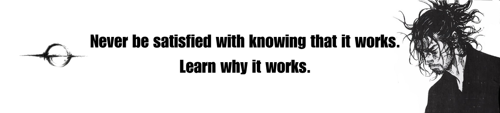
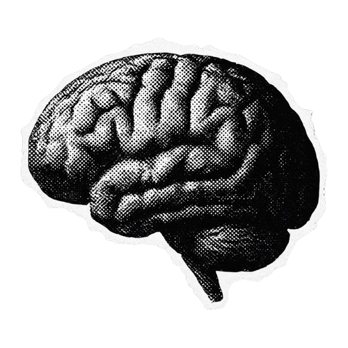

    

<h1 align="center" style="font-family: 'Segoe UI', 'Trebuchet MS', 'Arial', sans-serif; font-weight: 800; letter-spacing: 0.12em; text-transform: uppercase; color: #f5f7fa;">I'm John.</h1>

  Backend Developer • AI Engineer • CS Student

---

## Know about me.

<table>
<tr>
<td width="35%" align="center">

</td>
<td width="65%">

I'm a **Computer Science student** who enjoys figuring out how things work beneath the surface.

Currently exploring:

`Spring Boot` `Flutter` `PostgreSQL` `Docker` `Linux`

I learn best by building things, breaking them, and figuring out why they broke.

> **Understand deeply. Build simply. Improve endlessly.**

</td>
</tr>
</table>

## My top projects.

<table>
<tr>

<td width="65%">

<h2>RIKSA</h2>

  Education & social platform built with Spring Boot and Flutter. My competition (ACLEDA) project.

<h2>Dogehouse</h2>

  realtime talking where we interacts with each other and friend group audio only. My team revive this to live again, because we got some problems with discord.

<h2>Cinematism</h2>

  realtime talking where we interacts with each other and friend group audio only. My team revive this to live again, because we got some problems with discord.

> **I love building social collaboration project.**

<td width="35%" align="center">

</td>
</td>
</tr>
</table>
<h2 align="center" style="font-family: 'Segoe UI', 'Trebuchet MS', sans-serif; letter-spacing: 0.06em;">Connect</h2>

  &nbsp;&nbsp;&nbsp;

> **I build not because I know how, but because I want to find out.**

> Languages will change. Frameworks will disappear. The code I write today will eventually become obsolete.
> But every system I understand leaves something behind — the ability to think better, learn faster, and build what I couldn't build yesterday.
